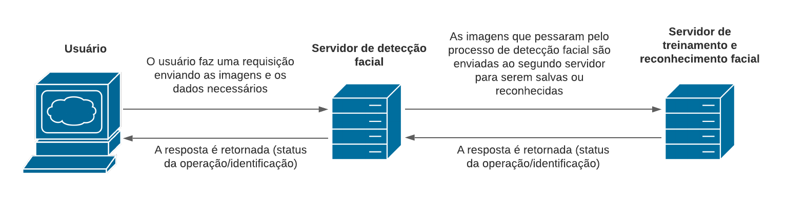

# face_recognition
- Um algoritmo de detecção e reconhecimento facial em Python3 utilizando a biblioteca OpenCV e conceitos de sistemas distribuídos.

- Para a comunicação entre os usuários/servidores será usado o protocolo de comunicação RPC, e para o reconhecimento facial três classificadores serão testados: Eigenface, Fisherface e LBPH.

## Arquitetura e funcionamento do sistema

<p align="center">
  
</p>

- Para que um indivíduo seja reconhecido a partir de uma imagem, é necessário que o mesmo forneça algumas fotos de seu rosto inteiro para fins de treinamento do algoritmo.

- Assim que o usuário executa o programa, ele deve escolher entre enviar suas fotos para o treinamento do o algoritmo ou realizar o reconhecimento facial, a partir dessa escolha uma mensagem é enviada para o servidor de detecção facial, esta mensagem contém uma ou mais imagens e os parâmetros necessários para que a operação seja realizada.

- Escolhendo a opção de treinamento, o usuário precisará fornecer o seu nome e algumas fotos de seu rosto que passarão por um processo de detecção facial no primeiro servidor, as imagens em que nenhum rosto foi detectado serão retornadas ao cliente, e as demais serão transferidas ao segundo servidor juntamente com o nome do usuário para que assim sejam armazenadas em um diretório específico. 
	- O status da operação é retornado ao cliente.

- Escolhendo a opção de reconhecimento facial, o usuário precisará fornecer apenas uma foto contendo um rosto e selecionar o algoritmo de classificação dentre os três apresentados. Esta imagem fornecida também passará por um processo de detecção facial no primeiro servidor que retornará uma mensagem ao cliente caso o número de rostos na imagem seja diferente de 1. Assim que a imagem é validada, a mesma será repassada ao segundo servidor para que o reconhecimento facial seja feito. Antes de realizar o reconhecimento, o servidor irá fazer o treinamento do algoritmo escolhido pelo usuário. 
	- O treinamento irá gerar um arquivo `.yml` que será armazenado neste mesmo servidor;
	- A foto recebida e o arquivo `.yml` gerado pelo treinamento serão usados para a execução do algoritmo de reconhecimento facial;
	- A identificação do indivíduo que consta na foto é retornada ao cliente.

- Otimização: Encontramos uma função na biblioteca que habilita o uso das funções do openCv de forma otimizada, o nome da função é cv.useOptimized(), para que assim possa agilizar o processo de detecção e reconhecimento das imagens.

- Paralelismo: Para que os clientes consigam acessar os servidores paralelamente, pensamos em fazer o uso de Threads em python, tanto no servidor que faz a detecção, quanto no que faz o reconhecimento, assim permitindo o acesso de multiplos clientes.

## Execução do programa

Primeiro é necessário compilar os arquivos `.proto` para que sejam geradas as classes necessárias para a comunicação, faça isso com os comandos:

```
python3 -m grpc_tools.protoc -I. --python_out=. -grpc_python_out=. proto/detection.proto
python3 -m grpc_tools.protoc -I. --python_out=. -grpc_python_out=. proto/trainingRecognition.proto
``` 

Agora já podemos iniciar os dois servidores e o cliente, com os comandos:

```
python3 server_1.py
python3 server_2.py
python3 gui.py
```
